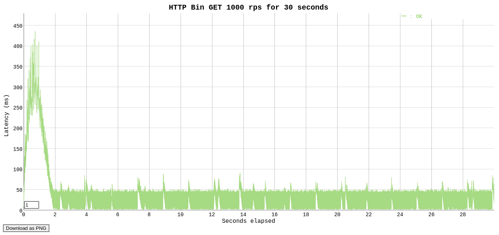

# letter-api

Este projeto segue a arquitetura DDD, utilizar container para injeção de dependências.

## Instalação

Para criar o arquivo `.env`.

Rodar `yarn` - Instalar as dependências do projeto.

### Testes Automatizados

Rodar `yarn test` - Verificar a integridade da aplicação

Rodar `yarn test-coverage` - Verificar a cobertura dos testes

### Servidor

Rodar `yarn start`

## Variáveis de ambiente

Para variáveis ​​de ambiente necessárias para executar o aplicativo, consulte o arquivo [.env.default](https://github.com/mateusxis/letter-api/blob/master/.env.default)

## Rotas

### Liveness

`GET /liveness` - Tem o objetivo de informar se a aplicação está rodando.

### Readiness

`GET /readiness` - Tem o objetivo de informar se aplicação está pronta para retornar os dados solicitados.

### Solicitando dados

`GET /letters` - Retornar um array de objeto da api de json-server.

## Teste de estresse

Foram realizados testes de estresse na aplicação, abaixo segue os resultados

### Teste 1000/rps em 30s

#### Resultados

| Parametro    | Critérios                        | Resultados                                                           |
| ------------ | -------------------------------- | -------------------------------------------------------------------- |
| Requests     | [total, rate, throughput]        | 30000, 1000.03, 998.28                                               |
| Duration     | [total, attack, wait]            | 30.052s, 29.999s, 52.587ms                                           |
| Latencies    | [min, mean, 50, 90, 95, 99, max] | 1.682ms, 27.048ms, 3.836ms, 49.984ms, 96.139ms, 280.564ms, 414.286ms |
| Bytes In     | [total, mean]                    | 774210000, 25807.00                                                  |
| Bytes Out    | [total, mean]                    | 0, 0.00                                                              |
| Success      | [ratio]                          | 100.00%                                                              |
| Status Codes | [code:count]                     | 200:30000                                                            |

### Teste 2000/rps em 30s

#### Resultados

| Parametro    | Critérios                        | Resultados                                                              |
| ------------ | -------------------------------- | ----------------------------------------------------------------------- |
| Requests     | [total, rate, throughput]        | 60000, 2000.04, 1283.53                                                 |
| Duration     | [total, attack, wait]            | 30.506s, 29.999s, 506.214ms                                             |
| Latencies    | [min, mean, 50, 90, 95, 99, max] | 25.723µs, 474.351ms, 700.064ms, 773.611ms, 789.367ms, 853.065ms, 1.204s |
| Bytes In     | [total, mean]                    | 1010473085, 16841.22                                                    |
| Bytes Out    | [total, mean]                    | 0, 0.00                                                                 |
| Success      | [ratio]                          | 65.26%                                                                  |
| Status Codes | [code:count]                     | 0:20845 200:39155                                                       |

Analizando os resultados o teste de estresse com 1000rps, a api teve 100% de sucesso. Com o teste de 2000rps, a api teve 65.26% de sucesso.

## Decisão técnica

Para melhorar a performance da letter-api, foi utilizado o conceito de memorização no serviço de busca dos endpoints de json-server, com recargas dos dados a cada 1 minutos. Com o objetivo, diminuir o tempo de resposta da letter-api.
